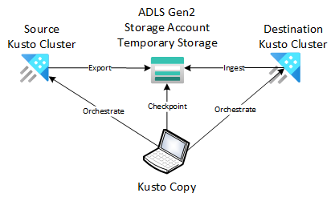

#   Kusto Copy

*Kusto Copy* is a command-line (CLI) utility providing copying capabilities between Kusto databases.  It supports both Azure Data Explorer (ADX) and Fabric Eventhouse.  It enables scenarios such as table copy, cluster migration, replication across region (BCDR) & others.

*Kusto Copy* is an orchestration tool exporting data on the source database and ingesting it on the other.  It has the following fundamental capabilities:

* Fault tolerant, i.e. the tool can be interupted and restarted
* Supports exact copy semantic (no data loss nor data duplication)
* Preserves extent *creation time*, which means the data copied should be the same "age" as the source data with respect to caching & retention policy



*Kusto Copy* also allow some more advanced features:

* Copy a query of a table, i.e. allowing transformation at the source e.g. horizontal and/or vertical filtering
* Copy "since last copy" ; this can be useful when planing a migration where it could take several hours or even days to copy the historic and you might want to copy the delta since you copied the history
* Can orchestrate the copy of multiple tables from multiple databases in one execution context

## Getting started

See the [introductory video](https://www.youtube.com/watch?v=5IxwTjSeqN4):

[](documentation/artefacts/introductory-video.png = 50x50)](https://www.youtube.com/watch?v=5IxwTjSeqN4)

You can find the command line interface (CLI) binary executable [here](https://github.com/Azure/kusto-copy/releases) for Linux, Windows & Mac.

Here is a usage example:

```
kc -s https://mycluster.eastus.kusto.windows.net/mydb/mytable -d https://yourcluster.eastus.kusto.windows.net/yourdb/ -t https://mystorageaccount.blob.core.windows.net/mycontainer/myfolder
```

That CLI invocation is configured as followed:

* The data lake checkpoint blobs are staging blob folders are located at https://mystorageaccount.blob.core.windows.net/mycontainer/myfolder
* The source cluster is https://mycluster.eastus.kusto.windows.net
    * The source database is mydb
    * The source table is mytable
* The destination cluster is https://yourcluster.eastus.kusto.windows.net
    * The destination database is yourdb
    * The destination table is mytable (implicitly takes the same value as the source if not specified)
* It will use the "current user" authentication to run queries / commands on both clusters

## Limitations

Known limitations:

*   Bound by source cluster's export capacity and the destination cluster's ingestion capacity
*   The tool doesn't track row deletions / updates, extent drops or purges

# Documentation

See the [full documentation here](documentation/README.md)