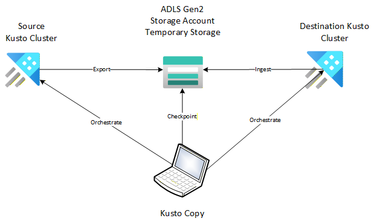
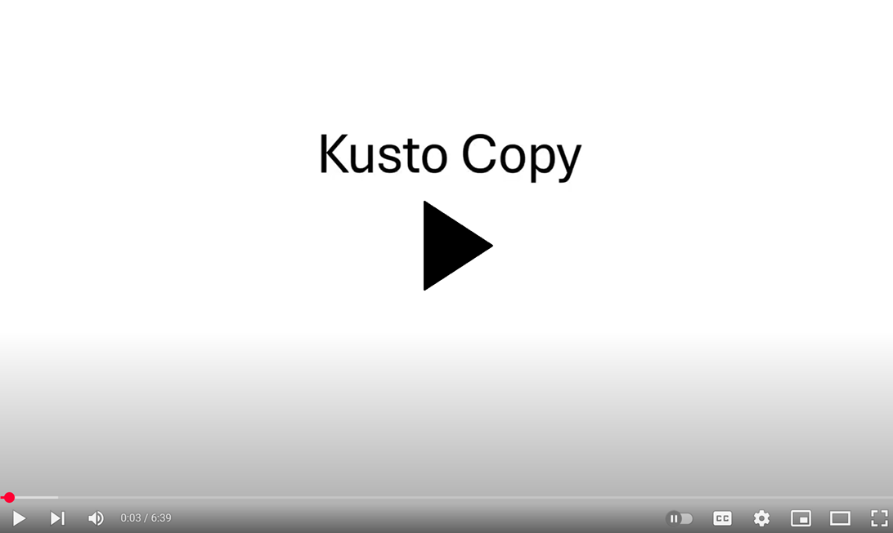

# 🚀 Kusto Copy

[](https://github.com/Azure/kusto-copy/releases)
[](https://opensource.org/licenses/MIT)
[](https://github.com/Azure/kusto-copy/releases)

> **The ultimate data migration tool for Kusto databases** ⚡  
> Move petabytes of data seamlessly between Fabric Eventhouse and Azure Data Explorer clusters

## 🎯 Why Kusto Copy?

**Stop wrestling with complex data migrations!** Whether you're migrating clusters, setting up disaster recovery, or backfilling materialized views, Kusto Copy eliminates the headache of large-scale data operations.

### ✨ What makes it special?

🔥 **Battle-tested at scale** - Handles petabytes without breaking a sweat  
🛡️ **Zero data loss guarantee** - Fault-tolerant with exact copy semantics  
⚡ **Resume anywhere** - Interrupted? No problem. Pick up right where you left off  
🕒 **Preserves data lineage** - Maintains extent creation times for accurate retention policies  
🎯 **Flexible transformations** - Copy queries, not just tables. Filter and transform on-the-fly

## 🔥 Power User Scenarios

| Use Case | Why You'll Love It |
|----------|-------------------|
| **🎯 Selective Data Copy** | Transform and filter data during migration |
| **🏢 Cluster Migration** | Move entire databases across regions with zero downtime |
| **🔄 Cross-Region Replication** | Occasional data synchronization for backup scenarios |
| **⚡ Delta Synchronization** | Copy only what's changed since last run |
| **� Materialized View Backfill** | Scalable historical data processing |
| **🔧 Update Policy Backfill** | Efficient batch processing for policy changes |

## 🚀 Quick Start

**Get up and running in 2 minutes!**

### 1️⃣ Download & Install
```bash
# Download the latest release for your platform
wget https://github.com/Azure/kusto-copy/releases/latest/download/kc
chmod +x kc
```

### 2️⃣ Run Your First Copy
```bash
./kc \
  -s https://source-cluster.eastus.kusto.windows.net/sourcedb/sourcetable \
  -d https://dest-cluster.westus.kusto.windows.net/destdb/ \
  -t https://storage.blob.core.windows.net/container/staging
```

**That's it!** 🎉 Your data is now copying with enterprise-grade reliability.

## 🏗️ Architecture & How It Works

Kusto Copy is an intelligent orchestration engine that manages the entire data pipeline:



**The magic happens in 3 steps:**
1. **📤 Smart Export** - Efficiently extracts data from source clusters
2. **☁️ Secure Staging** - Uses your Azure storage for reliable intermediate storage  
3. **📥 Optimized Ingestion** - Streams data into destination with maximum throughput

## 🎬 Watch It In Action

See how easy it is to migrate terabytes of data:

[](https://www.youtube.com/watch?v=5IxwTjSeqN4)

*Click to watch the 5-minute demo* ▶️

## 💡 Command Examples & Advanced Usage

<details>
<summary><strong>🔍 Query-Based Copying</strong> - Transform data on-the-fly</summary>

```bash
# Copy only specific columns and rows
kc -s "https://cluster.kusto.windows.net/db/table | where Timestamp > ago(30d) | project UserId, EventType, Timestamp" \
   -d https://dest-cluster.kusto.windows.net/destdb/ \
   -t https://storage.blob.core.windows.net/container/staging
```
</details>

<details>
<summary><strong>⚡ Delta Synchronization</strong> - Copy only what's new</summary>

```bash
# Copy only data since last successful run
kc --copy-mode BackfillAndNew -s https://source.kusto.windows.net/db/events \
   -d https://dest.kusto.windows.net/db/ \
   -t https://storage.blob.core.windows.net/container/staging
```
</details>

<details>
<summary><strong>🔄 Multi-Table Orchestration</strong> - Batch operations at scale</summary>

See the [YAML configuration documentation](documentation/README.md) for setting up complex multi-table copy operations.
</details>

## ⚠️ What to Know Before You Start

| Limitation | Impact | Workaround |
|------------|--------|------------|
| Export/Ingestion Capacity | Bounded by cluster limits | Scale clusters or batch operations |
| Row-Level Changes | Doesn't track deletions/updates | Use for append-only scenarios |
| Real-time Sync | Not designed for streaming | Use for batch migrations |

## 📚 Complete Documentation

Ready to dive deeper? Check out our comprehensive guides:

📖 **[Full Documentation](documentation/README.md)** - Everything you need to become a Kusto Copy expert

## 🎯 Ready to Get Started?

<table>
<tr>
<td width="50%">

### 🚀 For Quick Trials
**Just want to test it out?**
1. [Download the binary](https://github.com/Azure/kusto-copy/releases) 
2. Run the quick start example
3. See your data move in minutes!

</td>
<td width="50%">

### 🏢 For Production Deployments  
**Planning a major migration?**
1. Review the [full documentation](documentation/README.md)
2. Plan your staging storage strategy
3. Test with a small dataset first
4. Scale up with confidence!

</td>
</tr>
</table>

---

<div align="center">

**⭐ If Kusto Copy saves you time, give us a star!** ⭐

*Built with ❤️ by the Azure Data Explorer team*

</div>