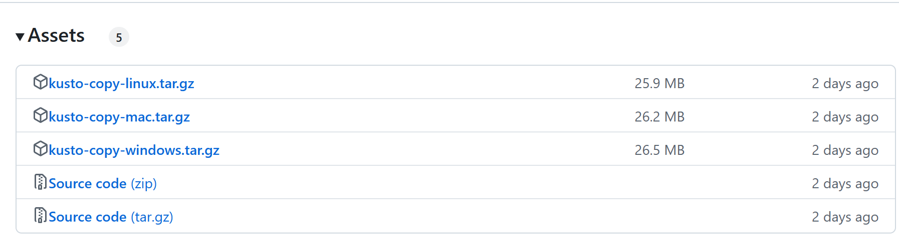

# Setup guide

This article will guide you through the setup to use Kusto Copy to copy a table from one cluster to another.

## Prerequisites

*   A source Kusto cluster (either Azure Data Explorer or Fabric Eventhouse)
    * Default workload group should be strongly consistent
    * `execute_show_command` plugin should **not** be [disabled](https://learn.microsoft.com/en-us/kusto/management/disable-plugin)
*   A destination Kusto cluster (either Azure Data Explorer or Fabric Eventhouse)
*   An ADLS gen 2 storage account
    * Soft Delete shouldn't be enabled
*   Somewhere to run the Kusto Copy CLI (e.g. a laptop, Cloud Shell, etc.)

## Download Kusto Copy CLI

You can download the CLI by going [here](https://github.com/Azure/kusto-copy/releases).  This is the release page and should show you a list of different releases starting with the latest one:



Download the package matching the OS you want to run on (Linux / Mac OS / Windows), uncompress it and you should be good to go.

## Permissions

Kusto Copy runs with an Azure Entra ID identity which identity will:

* Execute queries on the source database
* Ingest data, create temporary tables and run queries on the destination database
* Generate read / write SAS tokens in ADLS gen 2 storage container to export data and have it read for ingestion & also write directly audit blobs

Kusto Copy uses [DefaultAzureCredential](https://learn.microsoft.com/en-us/dotnet/api/azure.identity.defaultazurecredential?view=azure-dotnet).  For long running scenarios (i.e. more than 5-10 minutes), it is recommended to leverage a managed identity.  By default, **your identity** will be used by leveraging Azure CLI login (not recommended for long running scenarios).

### Source Database permissions

There are two ways to assign the **viewer role** to a principal:

* Control Plane
    * You can do it from the portal via the permission pane
    * Through Azure CLI
    * Through PowerShell
* Data Plane
    * By [running KQL commands](https://learn.microsoft.com/en-us/kusto/management/manage-database-security-roles?view=azure-data-explorer)

Although this permission can be assigned at the cluster level, the minimum permission requires to be at the database level.

### Destination Database permissions

You need to assign the **admin** permisison at the database level.

See previous section on how.

### ADLS Gen2 container permissions

You need to assign Azure RBAC roles **Storage Blob Delegator** & **Storage Blob Data Contributor** on the ADLS gen 2 container.

## Preparing the destination table

Kusto Copy **does not** create the destination table:  it expects it to be present with a schema compatible with what is exported from the source table.

## Running the tool

Here is an example:

```
kc -s https://mycluster.eastus.kusto.windows.net/mydb/mytable -d https://yourcluster.eastus.kusto.windows.net/yourdb/ -t https://mystorageaccount.blob.core.windows.net/mycontainer/myfolder
```

The parameters are the following:

Parameter|Mandatory|Description|Example
-|-|-|-
Source (-s)|x|Source database|https://mycluster.eastus.kusto.windows.net/mydb/mytable
Destination (-d)|x|Destination database or table|https://yourcluster.eastus.kusto.windows.net/yourdb or https://yourcluster.eastus.kusto.windows.net/yourdb/mytable
Staging Storage (-t)|x|One or many ADLS gen 2 containers (can be a sub folder)|https://mystorageaccount.blob.core.windows.net/mycontainer/myfolder
Query (-d)||Optional query|"\| where Level == 'error'"
Managed Identiy Client ID (--clientId)||If using User Managed Identity|Client ID guid

A couple of comments:

* The source always point to table using the notation \<cluster URI\>/\<database name\>/<\table name\>
* The destination can either be:
  * A table using the notation \<cluster URI\>/\<database name\>/<\table name\>
  * A database using the notation \<cluster URI\>/\<database name\>
* When the destination only specifies a database, the table name is infered from the source's table name
* The staging storage points to a container:  not only the storage account URL, but the container's URL
* A query is optional and allow you to transform the source table (e.g. filtering, projecting only some columns, etc.)

## Validating the copy

You should always validate the copy.  You can do this by looking at the number of rows but also by doing some sort of aggregation that returns a small amount of rows (or even just one number, e.g. the average of a column) you can compare with the source table.

